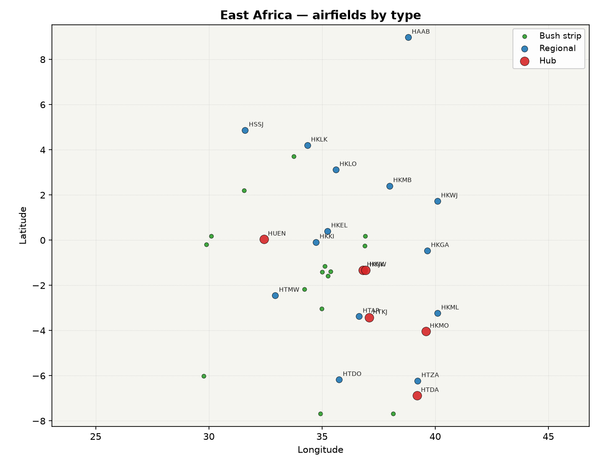

# East Africa airfields

Reference list of every airfield in the **East Africa** region of Outback Flying's airport catalogue (`src/data/airports.ts`), generated from the game data — not hand-maintained. Regenerate with `python scripts/generate-airport-docs.py` after editing that file.

**35 airfields** — 6 hub, 14 regional, 15 bush strip.

## Hubs

| ICAO | Name | State/Region | Runway | Surface | Lighted | Fuel |
|------|------|------|--------|---------|---------|------|
| HKJK | Nairobi Kenyatta | Kenya | 4120 m | sealed | Yes | AVGAS, JETA |
| HKMO | Mombasa Moi | Kenya | 3350 m | sealed | Yes | AVGAS, JETA |
| HKNW | Nairobi Wilson | Kenya | 1540 m | sealed | No | AVGAS, JETA |
| HTDA | Dar es Salaam | Tanzania | 3000 m | sealed | Yes | AVGAS, JETA |
| HTKJ | Kilimanjaro | Tanzania | 3600 m | sealed | Yes | AVGAS, JETA |
| HUEN | Entebbe | Uganda | 3660 m | sealed | Yes | AVGAS, JETA |

## Regional fields

| ICAO | Name | State/Region | Runway | Surface | Lighted | Fuel |
|------|------|------|--------|---------|---------|------|
| HAAB | Addis Ababa | Ethiopia | 3800 m | sealed | Yes | AVGAS, JETA |
| HKEL | Eldoret | Kenya | 3500 m | sealed | Yes | AVGAS, JETA |
| HKGA | Garissa | Kenya | 1080 m | sealed | No | AVGAS, JETA |
| HKKI | Kisumu | Kenya | 3300 m | sealed | Yes | AVGAS, JETA |
| HKLK | Lokichogio | Kenya | 1890 m | sealed | No | AVGAS, JETA |
| HKLO | Lodwar | Kenya | 1000 m | sealed | No | AVGAS, JETA |
| HKMB | Marsabit | Kenya | 1100 m | sealed | No | AVGAS, JETA |
| HKML | Malindi | Kenya | 1400 m | sealed | No | AVGAS, JETA |
| HKWJ | Wajir | Kenya | 2800 m | sealed | No | AVGAS, JETA |
| HSSJ | Juba | South Sudan | 3100 m | sealed | Yes | AVGAS, JETA |
| HTAR | Arusha | Tanzania | 1640 m | sealed | No | AVGAS, JETA |
| HTDO | Dodoma | Tanzania | 2040 m | sealed | No | AVGAS, JETA |
| HTMW | Mwanza | Tanzania | 3110 m | sealed | Yes | AVGAS, JETA |
| HTZA | Zanzibar | Tanzania | 3020 m | sealed | Yes | AVGAS, JETA |

## Bush strips

| ICAO | Name | State/Region | Runway | Surface | Lighted | Fuel |
|------|------|------|--------|---------|---------|------|
| HKHZ | Segera Ranch | Kenya | 1460 m | dirt | No | None |
| HKKE | Keekorok | Kenya | 1520 m | grass | No | None |
| HKMF | Mara North Conservancy | Kenya | 1400 m | dirt | No | None |
| HKMS | Mara Serena | Kenya | 1040 m | dirt | No | None |
| HKOY | Ol Seki Naboisho | Kenya | 1020 m | dirt | No | None |
| HKSL | Solio Ranch | Kenya | 1440 m | dirt | No | None |
| HTGR | Kirawira | Tanzania | 990 m | dirt | No | None |
| HTML | Mahale | Tanzania | 1060 m | dirt | No | None |
| HTMR | Msembe (Ruaha) | Tanzania | 1200 m | gravel | No | None |
| HTND | Ndutu | Tanzania | 1220 m | gravel | No | None |
| HTZW | Siwandu | Tanzania | 1280 m | dirt | No | None |
| HUGG | Bugungu | Uganda | 1540 m | sand | No | None |
| HUKD | Kidepo | Uganda | 1490 m | gravel | No | None |
| HUKS | Kasese | Uganda | 1680 m | grass | No | AVGAS |
| HUMW | Mweya | Uganda | 1250 m | dirt | No | None |
