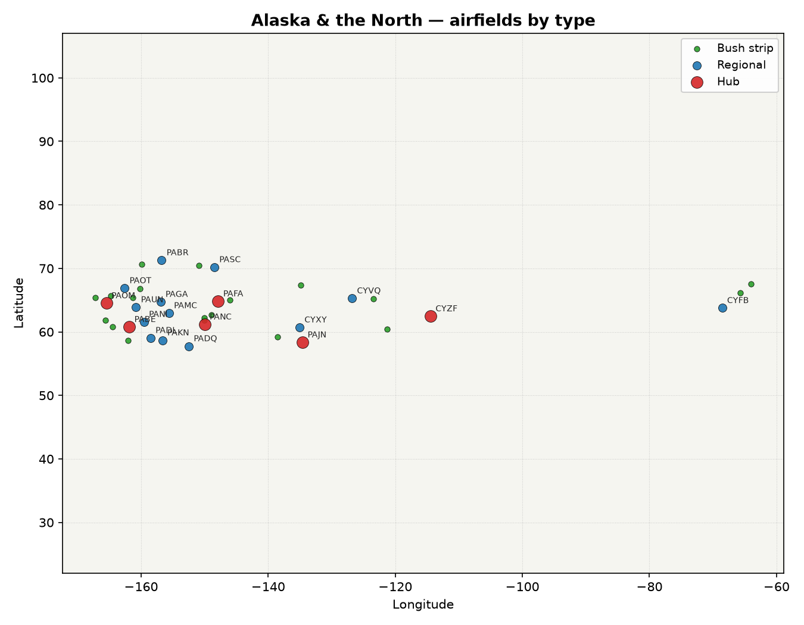

# Alaska & the North airfields

Reference list of every airfield in the **Alaska & the North** region of Outback Flying's airport catalogue (`src/data/airports.ts`), generated from the game data — not hand-maintained. Regenerate with `python scripts/generate-airport-docs.py` after editing that file.

**38 airfields** — 6 hub, 13 regional, 19 bush strip.

## Hubs

| ICAO | Name | State/Region | Runway | Surface | Lighted | Fuel |
|------|------|------|--------|---------|---------|------|
| CYZF | Yellowknife | Canada | 2290 m | sealed | Yes | AVGAS, JETA |
| PABE | Bethel | Alaska | 1950 m | sealed | Yes | AVGAS, JETA |
| PAFA | Fairbanks | Alaska | 3600 m | sealed | No | AVGAS, JETA |
| PAJN | Juneau | Alaska | 2700 m | sealed | Yes | AVGAS, JETA |
| PANC | Anchorage | Alaska | 3780 m | sealed | Yes | AVGAS, JETA |
| PAOM | Nome | Alaska | 1880 m | sealed | Yes | AVGAS, JETA |

## Regional fields

| ICAO | Name | State/Region | Runway | Surface | Lighted | Fuel |
|------|------|------|--------|---------|---------|------|
| CYFB | Iqaluit | Canada | 2620 m | sealed | Yes | AVGAS, JETA |
| CYVQ | Norman Wells | Canada | 1830 m | sealed | Yes | AVGAS, JETA |
| CYXY | Whitehorse | Canada | 2890 m | sealed | Yes | AVGAS, JETA |
| PABR | Utqiagvik (Barrow) | Alaska | 2160 m | sealed | Yes | AVGAS, JETA |
| PADL | Dillingham | Alaska | 1950 m | sealed | Yes | AVGAS, JETA |
| PADQ | Kodiak | Alaska | 2300 m | sealed | Yes | AVGAS, JETA |
| PAGA | Galena | Alaska | 1830 m | sealed | Yes | AVGAS, JETA |
| PAKN | King Salmon | Alaska | 2710 m | sealed | No | AVGAS, JETA |
| PAMC | McGrath | Alaska | 1810 m | sealed | No | AVGAS, JETA |
| PANI | Aniak | Alaska | 1890 m | sealed | No | AVGAS, JETA |
| PAOT | Kotzebue | Alaska | 1920 m | sealed | Yes | AVGAS, JETA |
| PASC | Deadhorse | Alaska | 1980 m | sealed | No | AVGAS, JETA |
| PAUN | Unalakleet | Alaska | 1800 m | sealed | Yes | AVGAS, JETA |

## Bush strips

| ICAO | Name | State/Region | Runway | Surface | Lighted | Fuel |
|------|------|------|--------|---------|---------|------|
| 02AK | Rustic Wilderness Airport | Alaska | 670 m | gravel | No | None |
| 51AK | Birch Creek Landing | Alaska | 760 m | grass | No | None |
| 8AK3 | Roland Norton Memorial Airstrip | Alaska | 910 m | gravel | No | None |
| AK13 | Chena Hot Springs Airport | Alaska | 910 m | gravel | No | None |
| AK20 | CD-3 Airstrip | Alaska | 1070 m | gravel | Yes | None |
| AK49 | Taylor Airport | Alaska | 670 m | gravel | No | None |
| AK61 | Stephan Lake Lodge Airport | Alaska | 910 m | grass | No | None |
| CEU9 | Sambaa K'e Airport | Canada | 1070 m | gravel | No | None |
| CYVM | Qikiqtarjuaq Airport | Canada | 1160 m | gravel | Yes | AVGAS |
| CYWJ | Déline Airport | Canada | 1200 m | gravel | No | AVGAS |
| CYXP | Pangnirtung Airport | Canada | 890 m | gravel | Yes | AVGAS |
| CZFM | Fort Mcpherson Airport | Canada | 1070 m | gravel | Yes | AVGAS |
| K3AK | Dry Bay Airport | Alaska | 1100 m | gravel | No | None |
| LSR | Lost River 1 Airport | Alaska | 1110 m | gravel | No | None |
| PACM | Scammon Bay Airport | Alaska | 910 m | dirt | Yes | AVGAS |
| PAEH | Cape Newenham LRRS Airport | Alaska | 1200 m | gravel | Yes | None |
| PAEW | Mertarvik Airport | Alaska | 1010 m | gravel | Yes | AVGAS |
| PAGZ | Granite Mountain Air Station | Alaska | 1180 m | gravel | No | None |
| PAWT | Wainwright Air Station | Alaska | 910 m | gravel | Yes | None |
