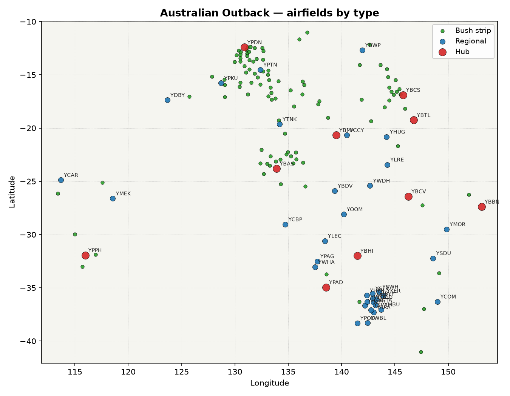

# Australian Outback airfields

Reference list of every airfield in the **Australian Outback** region of Outback Flying's airport catalogue (`src/data/airports.ts`), generated from the game data — not hand-maintained. Regenerate with `python scripts/generate-airport-docs.py` after editing that file.

**149 airfields** — 10 hub, 35 regional, 104 bush strip.

## Hubs

| ICAO | Name | State/Region | Runway | Surface | Lighted | Fuel |
|------|------|------|--------|---------|---------|------|
| YBAS | Alice Springs | NT | 2440 m | sealed | Yes | AVGAS, JETA |
| YBBN | Brisbane | QLD | 3560 m | sealed | Yes | AVGAS, JETA |
| YBCS | Cairns | QLD | 3200 m | sealed | Yes | AVGAS, JETA |
| YBCV | Charleville | QLD | 1520 m | sealed | Yes | AVGAS, JETA |
| YBHI | Broken Hill | NSW | 2510 m | sealed | Yes | AVGAS, JETA |
| YBMA | Mount Isa | QLD | 2560 m | sealed | Yes | AVGAS, JETA |
| YBTL | Townsville | QLD | 2440 m | sealed | Yes | AVGAS, JETA |
| YPAD | Adelaide | SA | 3100 m | sealed | Yes | AVGAS, JETA |
| YPDN | Darwin | NT | 3350 m | sealed | Yes | AVGAS, JETA |
| YPPH | Perth | WA | 3440 m | sealed | Yes | AVGAS, JETA |

## Regional fields

| ICAO | Name | State/Region | Runway | Surface | Lighted | Fuel |
|------|------|------|--------|---------|---------|------|
| YARA | Ararat Airport | VIC | 1240 m | sealed | Yes | AVGAS, JETA |
| YBDV | Birdsville | QLD | 1730 m | sealed | Yes | AVGAS, JETA |
| YBIR | Birchip Airport | VIC | 1040 m | sealed | Yes | AVGAS, JETA |
| YBWP | Weipa | QLD | 1650 m | sealed | Yes | AVGAS, JETA |
| YCAR | Carnarvon | WA | 1680 m | sealed | Yes | AVGAS, JETA |
| YCBP | Coober Pedy | SA | 1430 m | sealed | Yes | AVGAS, JETA |
| YCCY | Cloncurry | QLD | 2000 m | sealed | Yes | AVGAS, JETA |
| YCOM | Cooma | NSW | 2120 m | sealed | Yes | AVGAS, JETA |
| YDBY | Derby | WA | 1740 m | sealed | Yes | AVGAS, JETA |
| YDOD | Donald Airport | VIC | 1170 m | sealed | Yes | AVGAS, JETA |
| YHPN | Hopetoun Airport | VIC | 1140 m | sealed | Yes | AVGAS, JETA |
| YHSM | Horsham Airport | VIC | 1320 m | sealed | Yes | AVGAS, JETA |
| YHUG | Hughenden | QLD | 1640 m | sealed | Yes | AVGAS, JETA |
| YKER | Kerang Airport | VIC | 1070 m | sealed | Yes | AVGAS, JETA |
| YLEC | Leigh Creek | SA | 1710 m | sealed | Yes | AVGAS, JETA |
| YLRE | Longreach | QLD | 1940 m | sealed | Yes | AVGAS, JETA |
| YMBU | Maryborough Airport | VIC | 1040 m | sealed | Yes | AVGAS, JETA |
| YMEK | Meekatharra | WA | 2180 m | sealed | Yes | AVGAS, JETA |
| YMOR | Moree | NSW | 1610 m | sealed | Yes | AVGAS, JETA |
| YOOM | Moomba | SA | 1720 m | sealed | Yes | AVGAS, JETA |
| YPAG | Port Augusta | SA | 1650 m | sealed | Yes | AVGAS, JETA |
| YPKU | Kununurra | WA | 1830 m | sealed | Yes | AVGAS, JETA |
| YPOD | Portland Airport | VIC | 1620 m | sealed | Yes | AVGAS, JETA |
| YPTN | Tindal / Katherine | NT | 2740 m | sealed | Yes | AVGAS, JETA |
| YSDU | Dubbo | NSW | 1710 m | sealed | Yes | AVGAS, JETA |
| YSLK | Sea Lake Airport | VIC | 1040 m | unknown | No | AVGAS, JETA |
| YSTA | Saint Arnaud Airport | VIC | 1000 m | sealed | Yes | AVGAS, JETA |
| YSWH | Swan Hill Airport | VIC | 1500 m | sealed | Yes | AVGAS, JETA |
| YSWL | Stawell Airport | VIC | 1400 m | sealed | Yes | AVGAS, JETA |
| YTNK | Tennant Creek | NT | 1960 m | sealed | Yes | AVGAS, JETA |
| YWBL | Warrnambool Airport | VIC | 1370 m | sealed | Yes | AVGAS, JETA |
| YWDH | Windorah | QLD | 1370 m | sealed | Yes | AVGAS, JETA |
| YWHA | Whyalla | SA | 1690 m | sealed | Yes | AVGAS, JETA |
| YWKB | Warracknabeal Airport | VIC | 1370 m | sealed | Yes | AVGAS, JETA |
| YWYF | Wycheproof Airport | VIC | 1030 m | unknown | No | AVGAS, JETA |

## Bush strips

| ICAO | Name | State/Region | Runway | Surface | Lighted | Fuel |
|------|------|------|--------|---------|---------|------|
| YABF | Aberfoyle Airport | QLD | 660 m | dirt | No | None |
| YABG | Abbieglassie Airstrip | QLD | 1100 m | dirt | No | None |
| YALR | Aileron Roadhouse | NT | 1288 m | unknown | No | None |
| YANL | Anthony Lagoon Homestead | NT | 1102 m | unknown | No | None |
| YARP | Arapunya | NT | 620 m | unknown | No | None |
| YBDP | Flinders Island Aviation (Bridport) | TAS | 760 m | gravel | No | None |
| YBES | Beswick | NT | 1145 m | unknown | No | None |
| YBIG | Bing Bong | NT | 250 m | sand | No | None |
| YBIT | Bullita | NT | 960 m | unknown | No | None |
| YBRA | Benambra Airport | VIC | 1160 m | gravel | Yes | None |
| YBWL | Bramwell Station | QLD | — | unknown | No | None |
| YCCR | Coomalie Creek WW2 | NT | 1659 m | unknown | No | None |
| YCDW | Dallachy/Cardwell | QLD | — | unknown | No | None |
| YCNP | Channel Point | NT | 1355 m | unknown | No | None |
| YCNS | Coniston Station | NT | 1327 m | unknown | No | None |
| YCPK | Coombing Park Airport | NSW | 1160 m | dirt | No | None |
| YCVA | Clare Valley Aerodrome | SA | 1200 m | dirt | No | AVGAS |
| YCYT | Crystalbrook Station | QLD | 1100 m | unknown | No | None |
| YDLD | Delmore Downs Homestead | NT | 1274 m | unknown | No | None |
| YDPR | Dneiper | NT | 1700 m | unknown | No | None |
| YDRY | Drysdale Island | NT | 715 m | unknown | No | None |
| YDSV | Dorisvale | NT | 1290 m | unknown | No | None |
| YELZ | Elizabeth Downs | NT | 1300 m | unknown | No | None |
| YFRV | Oombulgurri Airport | WA | 1180 m | dirt | No | None |
| YFSR | Fisher | NT | 1022 m | unknown | No | None |
| YGOR | Gorrie WW2 | NT | 1908 m | unknown | No | None |
| YGTC | Gemtree Roadhouse | NT | 1350 m | unknown | No | None |
| YHBP | Homebush Park | NT | 1788 m | unknown | No | None |
| YHOV | Hodgson River Homestead | NT | 836 m | unknown | No | None |
| YHSB | Horseshoe Bend | NT | 1573 m | unknown | No | None |
| YKAB | King Ash Bay | NT | 977 m | unknown | No | None |
| YKOH | Koolpinyah | NT | 1445 m | unknown | No | None |
| YKUR | Kurundi Airport | NT | 890 m | dirt | No | None |
| YLAE | Labelle Downs | NT | 1120 m | unknown | No | None |
| YLEA | Leeman Airport | WA | 1200 m | dirt | No | None |
| YLIT | Litchfield Station | NT | 1211 m | unknown | No | None |
| YLRS | New Laura | QLD | 1000 m | unknown | No | None |
| YMCE | Mount Clere Homestead Airport | WA | 1200 m | dirt | No | None |
| YMEE | Merlin Diamond Mine | NT | 2438 m | dirt | No | None |
| YMHO | Mount House Airport | WA | 1070 m | dirt | No | None |
| YMIR | Miranda Downs Airport | QLD | 1010 m | dirt | No | None |
| YMJI | Murranji Station | NT | 1109 m | unknown | No | None |
| YMKC | Mistake Creek | NT | 815 m | unknown | No | None |
| YMRG | Murgon Airport | QLD | 720 m | grass | No | None |
| YNCW | Newcastle Waters | NT | 2120 m | unknown | No | None |
| YNHL | Nhill Airport | VIC | 1100 m | grass | Yes | AVGAS |
| YPFL | Preston Field - Blair Howe | WA | 920 m | gravel | No | None |
| YPGH | Pigeon Hole Airport | NT | 1040 m | dirt | No | None |
| YQ01 | Cannibal Creek | QLD | — | unknown | No | None |
| YQ02 | Wonga Beach | QLD | 1100 m | dirt | No | None |
| YQ03 | Bustard Downs | QLD | 550 m | unknown | No | None |
| YQ04 | Mount Dickson | QLD | — | unknown | No | None |
| YQ05 | Mount Mulligan | QLD | — | unknown | No | None |
| YQ06 | Cabana Station | QLD | — | unknown | No | None |
| YQ07 | Knox Creek | QLD | — | unknown | No | None |
| YQ08 | Koah Private | QLD | — | unknown | No | None |
| YQ09 | Port Stuart | QLD | — | unknown | No | None |
| YQ10 | Hurricane Station | QLD | — | unknown | No | None |
| YQ11 | Bathurst Head Outstation | QLD | — | unknown | No | None |
| YRLH | Riversleigh | QLD | — | unknown | No | None |
| YUSL | Useless Loop Airport | WA | 1000 m | dirt | No | None |
| YWGM | White Gum Air Park | WA | 1160 m | dirt | No | None |
| YWNR | Woolner | NT | 848 m | unknown | No | None |
| YWOU | Wombungi | NT | 770 m | unknown | No | None |
| YWSN | Woodstock Station | QLD | — | unknown | No | None |
| YX01 | Dundee Beach | NT | 1382 m | unknown | No | None |
| YX05 | Mary River Station | NT | 878 m | unknown | No | None |
| YX07 | Cape Wessel | NT | 460 m | unknown | No | None |
| YX08 | Marrakai Road | NT | 1114 m | unknown | No | None |
| YX12 | Colson Track | NT | 1644 m | unknown | No | None |
| YX13 | Jinka Homestead | NT | 1515 m | unknown | No | None |
| YX14 | Redgum Store | NT | 1024 m | unknown | No | None |
| YX16 | Ilpurla | NT | 882 m | unknown | No | None |
| YX17 | Mount Zeil Wilderness Park | NT | 1116 m | unknown | No | None |
| YX18 | Milton Park Homestead | NT | 1310 m | unknown | No | None |
| YX19 | Hamilton Downs | NT | 1256 m | unknown | No | None |
| YX21 | Dunmarra Roadhouse | NT | 1200 m | unknown | No | None |
| YX22 | Indiana Station | NT | 1098 m | unknown | No | None |
| YX23 | Beetaloo Station | NT | 1198 m | unknown | No | None |
| YX26 | Spirit Hills Station | NT | 988 m | unknown | No | None |
| YX27 | Yambah Station | NT | 1570 m | unknown | No | None |
| YX28 | Melaleuca Station | NT | 2000 m | unknown | No | None |
| YX29 | Fish River Homestead | NT | 1028 m | unknown | No | None |
| YX30 | Finnis River Homestead | NT | 881 m | unknown | No | None |
| YX33 | Atula Homestead | NT | 1160 m | unknown | No | None |
| YX34 | Phillip Creek | NT | 865 m | unknown | No | None |
| YX35 | Dry River Station | NT | 1084 m | unknown | No | None |
| YX36 | Deleye | NT | 1130 m | unknown | No | None |
| YX37 | Scott Creek Station | NT | 1770 m | unknown | No | None |
| YX38 | Fenton WW2 | NT | 2090 m | gravel | No | None |
| YX41 | Munmarlary Homestead | NT | 1034 m | unknown | No | None |
| YX42 | Nourlangie Homestead | NT | 1342 m | unknown | No | None |
| YX44 | Burrumburru | NT | 1250 m | unknown | No | None |
| YX45 | Redbank Wollogorang | NT | 1200 m | unknown | No | None |
| YX48 | Rombola Family Farms | NT | 1140 m | unknown | No | None |
| YX49 | Mount Bundy Station | NT | 1030 m | unknown | No | None |
| YX52 | Timber Creek Racetrack | NT | 1011 m | unknown | No | None |
| YX53 | Cockatoo Lagoon | NT | 911 m | unknown | No | None |
| YX55 | Kalala Homestead | NT | 957 m | unknown | No | None |
| YX56 | Western Creek | NT | 1500 m | unknown | No | None |
| YX57 | Old Delamere | NT | 1345 m | unknown | No | None |
| YX58 | Broadmere | NT | 1124 m | unknown | No | None |
| YX60 | Macdonald WW2 | NT | 1562 m | gravel | No | None |
| YX62 | Strauss WW2 | NT | 1586 m | unknown | No | None |
